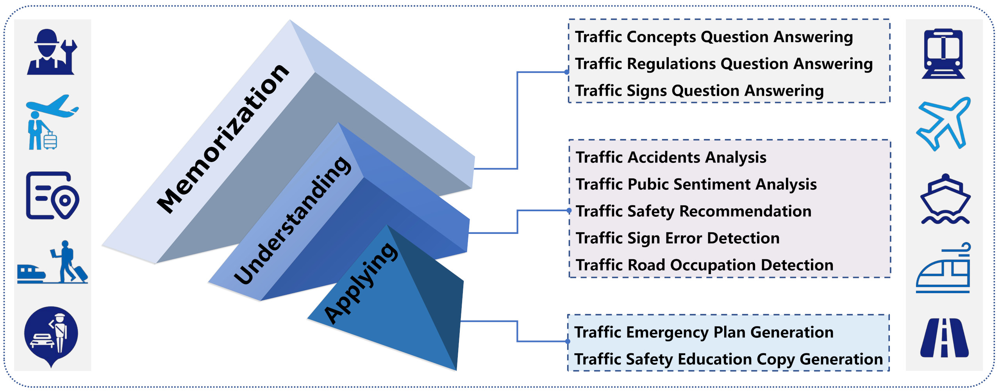
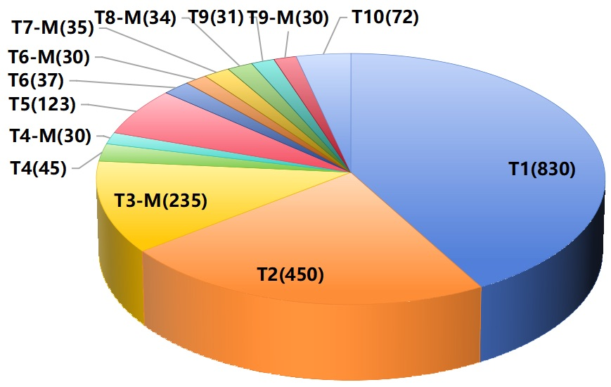

# TransportationGames

---

想知道你的模型在交通领域的任务上表现如何吗？快来通关**TransportationGames**吧！

**TransportationGames**是一个交通领域的benchmark，用来测评模型对交通领域知识的记忆、理解和应用能力。通过综合考虑不同的交通场景（如城市交通、轨道交通、航空、航运等）、不同的受众群体（如社会公众、交通行业从业者等）以及充分结合实际生活中的应用实例，我们共挑选了10个任务构建了TransportationGames数据集，根据能力类别分类包含如下任务：记忆能力（交通概念问答/交通规则问答/交通标志问答）、理解能力（交通事故分析/交通公众舆情分析/交通安全建议/交通标志错误检测/道路占用监测）、应用能力（交通应急预案生成/交通安全教育文案生成）。不同的任务根据实际应用场景除了文本模态外可能还包含图片模态的输入信息。（请注意，目前我们只针对中文场景，后续我们将继续扩充评测数据，同时添加更多的评测任务。）

 <!--  -->

## 任务介绍

---

- 交通概念问答（T1）：测试模型对于交通概念的记忆能力，通过问模型一个基础的交通概念，看模型是否能回答正确；问题格式为包含A/B/C/D这4个选项的单选题或者判断正确/错误的判断题；如"请判断下面的说法是否正确？只需要回答正确或错误即可；汽车吊车及其他轮式专用机械车允许牵引1辆挂车。"、"请从下面的A、B、C、D四个答案中给问题选出一个正确答案；只需要回答选项名A或B或C或D即可；高速公路限速标志标明的最高时速不得超过多少公里？A.120公里 B.90公里 C.100公里 D.140公里"
- 交通规则问答（T2）：测试模型对于交通规则的记忆能力，问题都是关于具体的交通规则，如车辆行驶相关规则、车辆管理相关规则等；问题格式包含单选题和判断题；
- 交通标志问答（T3）：测试模型对于交通标志的记忆能力，给模型一张交通标志图和一个问题，模型需要明白该交通标志的具体含义同时做出正确的回答；问题格式包含单选题和判断题；
- 交通事故分析（T4）：给模型一段交通事故描述的文本或者一张交通事故的图片，模型需要能从中分析出该交通事故发生的具体原因；
- 交通公众舆情分析（T5）：给模型提供社会公众对于新颁发的交通规则/政策的意见或者对现有交通设置的不满，模型需要从中分析和总结出公众的真实诉求；
- 交通安全建议（T6）：给模型提供出行计划或出行天气状况，模型可以提供合理的出行安全建议；给模型提供相关驾驶场景的图片，模型能分析出存在的交通安全隐患并提供合理的安全建议；
- 交通标志错误检测（T7）：给模型提供交通标志图（交通标志线/交通指示牌等），模型可以分析出交通标志线的绘制或交通标识的设置是否合理，是否存在错误；
- 道路占用监测（T8）：给模型道路的图片或者轨道的相关图片，模型可以分析道路是否存在非法占用的情形；
- 交通应急预案生成（T9）：针对用户提出的不同场景，模型需要能生成合理的应急预案；
- 交通安全教育文案生成（T10）：针对用户给出的不同受众群体和安全教育场景，模型需要能生成合理有用的安全教育文案；

## 数据来源

---

上述任务主要涉及两种模态：文本模态和图像模态。

- 对于文本模态的数据，我们的原始数据集的主要来源于互联网。例如，对于有标准答案的问答数据，我们检索了大量交通领域的相关试卷；对于的事故报道或者社会公众的反馈建议主要来自于各个新闻网站和相关的市政管理平台。此外，诸如应急计划之类的专业文章主要从各机构官网的相关链接中下载得到。
- 对于图像模态的数据，我们采用基于关键字的查询从互联网中检索和选择赴符合条件的图像，同时保存图像标题或标题链接中的文本以供进一步分析。

## 评价指标

---

**Accuracy**：对于有标准答案的单选题和判断题（T1～T3任务），我们抽取出模型预测中的相关答案后，根据标准答案计算Accuracy；

**ROUGE**：对于文本生成类的任务（T4～T10任务），我们计算模型预测答案和参考答案的ROUGE-Chinese-L分数；

**GPT-4-Eval**：对于文本生成类的任务（T4～T10任务），考虑到正确答案的不唯一性，我们调用GPT-4从答案的正确性/冗余性/流畅度/完整性这四个方面对模型预测的答案进行打分；

## 评测流程

---

为了防止数据的直接泄漏，我们需要在您注册后提交申请测评的请求（单模态数据集和多模态数据集需要分开申请），同时您必须同意数据集的使用规范，然后我们将发送给您测试数据集，您得到结果后从网站提交您的结果；我们将尽快为您计算您模型的得分情况，无特殊要求外，我们会将测评结果添加到排行榜上。

如果您想参与测评，您需要做：

1. 注册账号；
2. 提交相应的测评申请；
3. 同意数据使用协议；
4. 拿到数据后对模型进行测试；
5. 按照规定格式上传您的结果；

## 联系我们

---

Email：{23111135, 22120416, 20241254, 20281284}@bjtu.edu.cn

## 论文引用格式

<pre style="margin:4px">
@misc{zhang2024transportationgames,
      title={TransportationGames: Benchmarking Transportation Knowledge of (Multimodal) Large Language Models}, 
      author={Xue Zhang and Xiangyu Shi and Xinyue Lou and Rui Qi and Yufeng Chen and Jinan Xu and Wenjuan Han},
      year={2024},
      eprint={2401.04471},
      archivePrefix={arXiv},
      primaryClass={cs.CL}
}
</pre>

